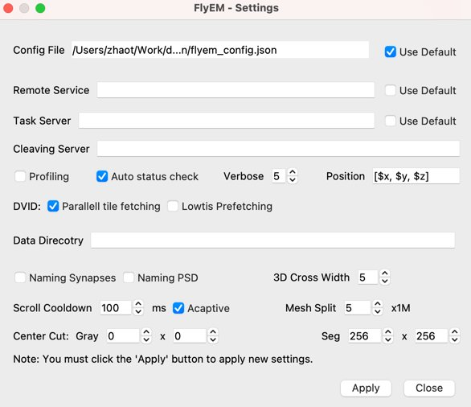

# Setting Dialog

The fields in the setting dialog are persistent, which means that they are saved after the `Apply` button is clicked.

- Remote service: URL for remote services. This is mainly for setting up the [skeletonization service](https://github.com/janelia-flyem/neutuse).
- Task Server: Ignore it for now.
- Cleaving Server: server URL for computing body cleaving.
- ~~Profiling~~ (OBSOLETE)
- Auto status check: only servers as heartbeat in the current version.
- Verbose: verbose level for logging.
- Position: position text template, in which `$x`, `$y`, `$z` will be replaced by the x, y, z coordinates. This is mainly used in position copying.
- ~~Parallel tile fetching~~ (OBSOLETE)
- Lowtis Prefetching: prefetching data or not for grayscale and segmentation data. It has not turned out to be useful.
- Data Directory: default directory for saving data. Ignore it.
- ~~Naming Synapses~~ (OBSOLETE)
- ~~Naming PSD~~ (OBSOLETE)
- 3D Cross Width: width of the location cross in 3D view.
- Scroll Cooldown: cooldown time for scrolling, which can be used to reduce scrolling lag.
- Adaptive: makes scroll cooldown adaptive to scrolling speed to improve fps.
- Mesh Split: split meshes into smaller pieces to for faster 3D visualization.
- Center Cut
  - Gray: Highres area of the grayscale slice.
  - Seg: Highres area of the segmenation slice.

# Environment Variables

NeuTu/Neu3 also uses environment variables to configure the settings. The following variables are supported:

- `NEU3_CLEAVE_SERVER`: server URL for computing body cleaving.
- `NEUTU_LOG`: disable file logging if the value is `nofile`.
- `AUTHENTICATION_SERVER`: server URL for getting an authentication token. Used by protocols.
- `ASSIGNMENT_MANAGER`: server URL for orphan link protocol.
- `NEUROGLANCER_SERVER`: server URL for Neuroglancer.
- `NEU3_USE_PREFETCHING`: `yes` or `no` for body prefetching in Neu3.
- `NEUPRINT`: server URL for neuPrint.
- `NEUPRINT_AUTH`: file path for neuPrint authentication token.
- `DVID_BROWSE_DIALOG`: (EXPERIMENTAL) `yes` or `no` for using DVID browsing dialog or not.

