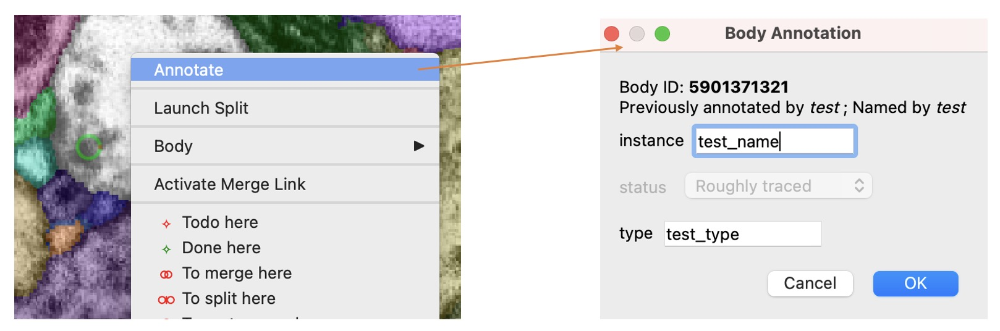
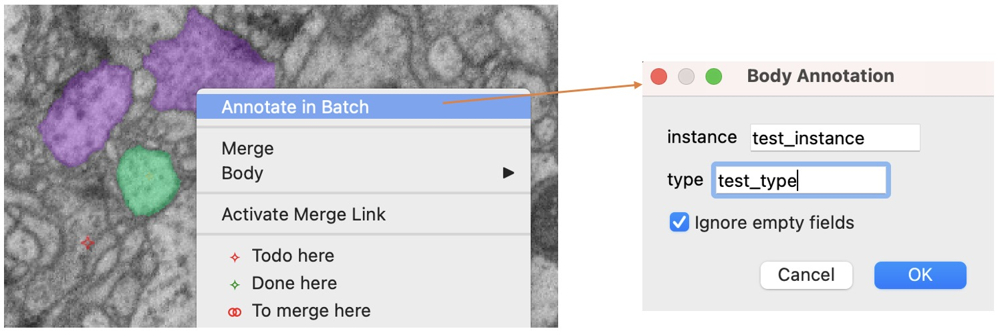

## Annotate a single body

## Annotate multiple bodies

When more than one body is selected, `Annotate in Batch` will show up in the context menu if it is available, which requires some configuration in the database. When `Ignore empty fields` is checked, any field with an empty input will be ignored.

